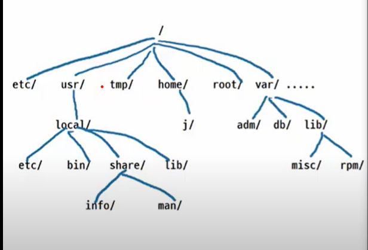

# 리눅스 기본 명령어

## 기초 명령어

- who : 누가 접속했는지 보여준다.
- whoami : 본인이 누구인지
- w : 이 사용자가 무엇을 하고 있는지 알 수 있다. from : 아이피주소, IDLE : 접속해서 아무것도 안한 시간
- users : 지금 접속한 사용자
- arch : 아키텍쳐의 약자 CPU 종류
- logname :로그인한 사용자가 누구인지
- uname : 유닉스 이름을 알려준다. 다양한 종류가 많이 있다. 
  - -o : 커널정보 -r : 커널버전 -a : 컴퓨터의 전체 정보
- hostname : 컴퓨터 이름을 나타낸다.
- id : 컴퓨터는 모든것을 숫자로 관리하는데 그 넘버를 이야기한다.
- pwd(print working directory) : 현재 디렉토리
- ls : 해당 디렉토리 안의 파일 정보
- ls -al : 숨김파일도 전부 볼 수 있다.
- ls -lh : 파일용량 바뀌어서 나온다
- mkdir 이름 : 디렉토리 생성
- rmdir 이름 : 디렉토리 삭제
- rm(remove) -rf 이름 : 폴더 강제 삭제
- mkdir k{1..20} : k1 . . . k20까지 폴더 한번에 생성
- cd ~ : 홈 디렉토리로 간다.
- cd : 아무것도 안적어도 홈 디렉토리로 간다.
- cd / : 시스템 디렉토리
- touch 이름 : touch는 원래 파일의 접근시간을 변경이지만 파일이 없다면 현재 시간으로 파일을 하나 만들어준다.
- cat > 이름 (리다이렉션): 달력의 내용을 해당 파일을 만들어서 넣음
- ll : ls -l 이다. alias 가 기본적으로 되어 있다.
- ll로 확인할 시 파일분류 권한 하드링크수 소유주 소유그룹 파일사이즈 파일수정시간 파일명
  - ex) -rw-rw-r--. 1 j j 0 2월 13 07:55 aa
  -  -로 시작 : 파일 , d로 시작 : 디렉토리
  - r : read, w : write, x : execute
  - j : 소유주
  - ls 옵션
    - -lSr : 파일 크기 순으로 오름차순 정렬
    - -R : 하위 디렉토리까지 본다.
  - echo $HOME : $HOME이라는 변수에 무엇이 들어있는지 확인할 수 있다.
- 명령어 alias 만들기
  - ex) alias lh='ls -lh'
- tab : 자동완성기능
- ps -ef : 프로세스 검색


## 파일 내용 보기

- cp 경로 새로운파일이름 : 파일 복사
- cat 파일이름 : 파일 내용 보기
  - cat 이름 -n : 행번호 추가
  - cat 이름 -b : 공백 행번호 추가 x
- nl 파일이름 : 행번호 붙어서 볼 수있다.
- less 이름, more 이름 : 페이지처럼 넘기면서 볼 수 있다. 탈출할 땐 q
- head [-숫자] 파일이름 : 위에서 해당 줄만큼 보여준다. 
- tail [-숫자] 파일이름 : 밑에서 해당 줄만큼 보여준다. 

## 도움말 보기

- [] : 생략 가능 , ... : 중복 허용
- man 명렁어 : 매뉴얼 보는 것이다.
- info 명령어 : 정보 보는 것이다.
- 명렁어 --help : 
  - 스페이스바 : 페이지 이동, 엔터 : 한줄씩, b : 뒤로 이동 , /내용 : 검색

## 디렉터리 구조

- -> : 심볼릭 링크 : 윈도우의 바로가기랑 비슷하다.   
- bin : 바이너리의 약자, 즉 실행파일들이 모여있다. 
- boot : 부팅과 관련된 것들
- dev : 디바이스(장치)의 약자, 키보드, 모니터, 마우스, usb 등등 모여있다.
- etc : 설정파일들이 담겨있따.
- home : 일반 사용자들이 모여있는 곳
- lib : 라이브러리 약자 
- media : 미디어 장치
- mnt : 마운트하는곳, 시디롬 ? 이런 과거에 사용하던 것들이 들어있는 곳이다.
- opt : 리눅스 이외의 추가의 소프트웨어들이 opt에 들어간다.
- proc : 프로세스의 약자, 메모리상태의 설정값이 들어가있고, 하드디스크가 아닌 메모리 상태이다.
- root : 루트의 홈 디렉토리
- run : 현재 실행하는 프로세스 저장
- sbin : 슈퍼사용자(시스템관리자)들이 사용하는 명령어들이 모여있다. bin은 일반 사용자들이 사용하는 명령어들이 모여있다.
- tmp : 임시 디렉토리 , 원래 일반 사용자들이 자기 홈 디렉토리 이외에는 사용할 수 있는곳이 없지만 유일하게 tmp는 사용할 수 있다.
- usr : 유닉스 시스템 리소스 약자, 윈도우에서 프로그램 파일같은 곳이다. 우리가 프로그램을 설치하면 usr에 들어간다.
- var : variable, 가변적인 디렉토리, 외부에서 메일이 들어오거나 설정값, http 서비스, html 문서같은 것들이 여기에 담긴다.

</img>

## 디렉토리 이동

- / : 시스템 루트 디렉토리
- ~ : 홈 디렉토리 (자기자신의)
- . : 현재 디렉토리
- .. : 부모 디렉토리
- 절대경로 : /부터 이동
- 상대경로 : 현재부터 이동 

## 리눅스 파일 복사(cp), 삭제(rm)

- cp /etc/a* .: copy의 약자, etc밑에 a로 시작하는 모든 것을 현재 위치로 복사
  - a* : a로 시작하는 모든 것
  - . : 현재 디렉토리를 나타낸다. 꼭 복사할 때 복사될 위치도 적어줘야한다.
- cp -r : -r을 사용하면 디렉토리까지 복사해준다.
- rm a* : a로 시작하는 파일 삭제 , 폴더는 삭제되지 않는다.
- rm -r a* : -r 옵션을 사용하면 디렉토리까지 삭제한다.
- cp 경로 새파일이름 : 현재 경로로 복사하면서 이름도 바꿀 수 있다.
  - ex) cp /etc/bashrc b2
  - 만약 현재 경로에 같은 이름이 있는데 복사를 하면 덮어쓰기가 된다.
  - 이럴 때 옵션 -i(interactive : 상호작용, 컴퓨터에선 대화형 모드라고 이해하자)를 쓰면 덮어쓸지 물어본다. ex) cp -i /etc/bashrc a2
  - -f : force, 안물어보고 강제로 진행한다.
  - 만약 똑같은 이름이 파일이 아닌 폴더인 경우 그 폴더 안으로 복사가 진행된다.
  - cp /etc/bashrc d2/d30 (d2 폴더가 있는 상태) : 해당 폴더 안에 d30이라는 이름으로 복사가 진행된다.
- rm [b-t]* : b부터 t까지 전부 지운다.
- rm -rf * : -f는 강제, -r(recursive, 디렉토리 포함)는 디렉토리까지 -> 디렉토리까지 강제로 지운다.
- rm [^xyz]* : xyz만 제외하고 다 지운다. 
- cp -r /etc . : etc 디렉토리를 통채로 복사

## 파일 이동(mv), 이름변경(rename)

- 결과 > 파일이름 : 이 결과를 이 파일이름으로 저장한다.
- mv 기존파일이름 변경파일이름 : 파일이름 변경
- rename a AAA a : a를 AAA로 바꿔라 원본은 a이다. (불편해서 mv를 많이쓴다.)
- mv 파일이름 디렉토리 : 해당 디렉토리로 이동
- 일반 사용자는 자기 홈 디렉토리(/home/seonsu) 에서만 작업이 가능하다. 다른곳에서 디렉토리를 만들거나 삭제할 수 없다.
- mv는 이동이지만 rename 기능도 포함하고 있다. 그리고 복사할 때처럼 똑같이 덮어쓰기를 하므로 조심하자.

## 실수하기 쉬운 에러 3가지

- command not fount
- echo $PATH : 명령어를 어디서 찾는지 볼 수 있다.
- 허가 거부
- 그런 파일이나 디렉토리 없음

## 리눅스 프로그램 설치 패키지관리(rpm, yum)

- rpm -qa : query all, 설치된 모든 패키지 목록 검색
  - rpm -qa | nl : number line 몇개 설치했는지 보여준다.
  - rpm -qa | grep <패키지> : 문자연 ftp와 관련된 패키지가 있는지 검색
- 네트워크 테스트 : ping -c3 8.8.8.8 : 패킷 3개를 주고 받는다.
- yum -y install <패키지> : 해당 패키지 설치  
- rpm -e <패키지> : 패키지 삭제

## 리눅스에서 c언어 코딩/컴파일

- gcc 설치
- 반드시 확장자는 .c 여야한다.
- vi로 만든뒤 gcc로 컴파일해서 실행할 때 그냥 파일 이름을 적으면 안된다. 왜냐하면 경로를 안적으면 $PATH에서 하나씩 찾는데 없기 때문이다.
- 그래서 현재경로인 ./a.out을 해줘야 실행이된다.
- 만약 경로로 안적고 바로 사용하려면 환경변수처럼 경로를 설정해줄 수 있다.
- PATH=$PATH:.  이렇게 적어주면 된다. 하지만 이렇게 설정하면 로그아웃했다가 다시 로그인하면 사라진다.
- gcc t.c -o aa : output의 약자 => aa라는 파일 이름으로 컴파일한다. 

## ftp 사용법

- get : 파일 가져올 때
- mget : multiple put 여러개 가져올 때
- put : 업로드할 때
- mput : 여러개 업로드
- 명령어를 모르겠다면 ? get 이런식으로 쳐볼것
- 파일 더블클릭 후 오른쪽 클릭하면 명령어창에 입력됨
- !ls : 다운로드 됐는지 확인 
- ls : 원격 디렉토리 구조 확인
- by : 나가기

## 압축하기

- gzip 파일이름 : 파일 압축
- gunzip 파일이름 : 압축 풀기
- xz 파일이름 : 파일 압축(gzip보다 속도는 더 빠르지만 압축률은 더 높다.)
- unxz 파일이름 : 압축 풀기
- tar.gz : tar와 gz, 2번 풀어야한다.  원래 압축은 하나의 파일로 묶고 압축하고 이렇게 2가지 일이 일어나는 것이다.
  - tar : tape archiver : 여러 개의 파일을 하나의 파일로 묶을 때 사용
  - tar xf 파일.tar : 묶은 파일 풀기
  - tar cf 만들파일이름 묶을디렉토리: 파일을 묶는다.
  - tar cfz 만들파일이름 묶을디렉토리: c : create, f : file 공통 옵션, z : gzip => 한번에 묶어서 압축해준다.
  - tar xfz : x : extract => 한번에 풀겠다.
- du -sh : disc use, 파일 용량 확인

## 권한

- r : read - 4
- w : write(생성, 삭제, 수정) - 2
- x : execute - 1
- ``` - ``` : 권한 없음
- whereis 명령어 : 명령어가 어디있는지
- -rwxr-xr-x : 3개씩 끊어서 읽는다 rwx(소유주 권한), r-x(소유그룹 권한), r-x(others 권한)
  - ex) -rwxr-xr-x. 1 root root 67880  5월 19  2021 /usr/bin/cal
  - /usr/bin/cal 이라는 이 파일은 주인이 root 에게 읽고 쓰고 실행할 수 있는 권한(rwx)이 있고 소유 그룹인 root 그룹에게도 읽고 실행 권한이 있고(r-x(쓰기 권한은 없다)) others 에게도 읽고 실행 권한(r-x)이 있다.
- chmod 권한번호 해당경로 : change mode => 해당 파일 권한 변경
  - 권한번호는 숫자로 지정하면 된다.
  - ex) -rwxr-xr-x : rwx =>7 , r-x => 5, r-x => 5
  - 그래서 위의 권한번호는 755가 된다.

## 리눅스 파일 분류

- 리눅스는 모든 것을 파일로 간주한다. 프린터, 키보드, 모니터, 하드디스크, 디렉토리 ...
- file $경로 : 파일 타입
  - ELF 64-bit : executable and Linkable Format => 64비트 실행파일이다. (바이너리 파일)
- l : 심볼릭 링크
- c : character device : 프린터기, 키보드 이런것들
- b : block device : 저장장치 같은 것들
- s : socket
- p : named pipe : 무언가 연결해준다.
- find 경로 -type 타입 : 해당 경로에서 타입에 맞는 파일을 검색
- find 경로 -name 이름 

## 심볼릭 링크, 하드링크(이 파일의 링크가 몇개인지? 그런느낌)

- ll -i : 인덱스를 나타낸다. (inode) 포인터, 참조값이랑 관련있다. (하드디스크의 주소값 느낌)
- inode : 컴퓨터가 사용자를 관리할 때 넘버를 붙여서 관리한다. uid, gid 이런것들.. 그런데 file을 관리할 땐 인덱스 넘버를 붙여서 관리한다. 그 인덱스 넘버를 inode라고 한다.
- ln 파일 만들파일 : link, 이렇게 파일을 만들면 인덱스는 같지만 하드링크 숫자가 달라진다. 파일이 여러개처럼 보이지만 물리적으로 파일은 하나이다. 파일은 하나인데 이름이 여러개인 느낌 
- ln -s 파일 만들파일 : 심볼릭 링크 (->) : 윈도우에 있는 바로가기처럼 이 파일이 실행파일을 가지고 있는게 아닌 실행파일의 주소를 가지고 있는 것이다. 
- 만약 심볼릭 링크가 걸린 파일을 제거하면 깨졌다는 표시가 나온다.

## alias : 명령어 별칭

- alias 문자='명령어' : alias 주는 법
- unalias 문자 : alias 해제
- 하지만 터미널에서 alias를 설정하고 새로 로그인하면 설정이 사라진다. 그래서 bash파일에서 설정을 해줘야 한다.

## history

- 쉘에서 $는 변수라는 의미 , echo는 화면에 뿌리는 것
- 컨트롤 + p : 위쪽 방향키와 동일
- 컨트톨 + n : 아래쪽
- !history번호 : 해당 명령어 실행
- !! : 바로 이전에 내렸던 명령어 다시 실행
- !단어 : 가장 최근에 내렸던 명령어중 단어가 포함된것 실행한다.
  - ex) date 실행하고 다음에 !d 실행하면 동일하게 date가 실행된다.
- history 숫자 : 가장 최근의 숫자 갯수만큼 history를 보여준다.
- echo $HISTSIZE : 1000 : 가장 최근부터 1000개의 명령어를 저장
- HISTTIMEFORMAT="%Y-%m-%d %H:%M:%S"
  - 이렇게 설정하면 명령어가 언제 실행됐는지 확인할 수 있다.
  - 날짜 형식의 포맷 %년-%월-%일 %시:%분:%초
- history -c : 히스토리 초기화

## bash

- 로그인을 하면 여러가지 설정들이 일어난다.
  - /etc/profile 전부 읽어간다.
  - /etc/profile.d/*.sh 전부 읽어간다.
  - 홈 디렉토리에 와서 각 개인의 마스터 파일을 읽어간다.
    - .bash_profile  
    - .bashrc
    - /etc/bashrc ==> $PS1
    - .bash_history
    - .bash_logout     

- env : environment , 환경변수의 약자
- $HOSTNAME : 이러한 것들을 환경변수라고 한다. 
- echo $SHELL : 내가 현재 사용하고 있는 쉘
- chsh -l : change shell -list
- sh, bash 를 본쉘이라고 한다. bash는 bourne Again Shell이라고 해서 본쉘의 클론이라고 한다. 
- vi /etc/profile 쭉 보면 #는 주석문이다. 쉘 프로그래밍은 나중에 보자
- .bash_logout : 로그아웃하면 어떤 일을 할 것인지 저장하고 있는 파일
- .bash_history : 내가 지금까지 내렸던 명령어들 저장
- .bash_profile : 
  - profile에서 변수를 추가해주면 환경변수처럼 사용할 수 있다.
  - 값을 추가해줘도 처음 로그인 했을 땐 적용이 안되어있기 때문에 지금 세션에 적용시켜야된다.
  - source ~/.bashrc : bashrc파일 다시 적용시키기
- .bashrc 
  - 조건문에서 -f : 파일이 존재하는지 여부
- export : 지역변수를 전역변수화 시키는 기능이다.
  - 우리가 bash_profile에 변수를 넣고 source ~/.bash_profile을 해주면 다시 파일을 적용하면서 변수가 적용된 것을 볼 수 있다.
  - 여기서 bash를 다시 실행해서 별도의 쉘을 만든다면 변수를 사용할 수 없을 것이다. 지역변수의 개념이다. 이것을 전역변수로 만들어주기 위해 부모 쉘에서 export AGE 해주면 다른 쉘에서도 사용할 수 있다.
- alias와 함수도 설정해주기 위해 bashrc에서 수정해주자.
- etc에 있는 파일들은 읽을 수만 있고 수정을 못하므로 개인 마스터 파일에서 수정하자

## 명령 프롬프트 설정

- PS1 : 명령 프롬프트
- PS2 : 보조 프롬프트
  - ex) echo "cjdksdj 만 하고 엔터를 친 경우 안끝나고 계속 칠 수 있다.
  - 컴퓨터는 " 를 기다리는 중이다. 그래서 " 닫아줘서 끝내야한다.
  - 컨트롤 + c로 캔슬해도 되지만 닫아주자
- 자동완성기능 tab
  - 한 번 눌렀는데 가만히 있으면 여러개 있다는 소리다.
  - 거기서 tab을 한 번 더 누르면 목록을 보여준다.

## 출력 재지향(redirection), 출력 재지향 파일에 추가하기

- 리눅스는 드래그만 해도 이미 복사가 된 상태이다.
- cal > a1 : cal의 출력 내용을 a1 파일에 저장한다.
- 만약 기존의 a1 파일이 존재한다면 덮어쓰기하니 조심하자
- date >> a1 : >>를 사용하면 덮어쓰기가 아닌 내용이 추가된다.

### 도스에서 모든 경로 표기하기

- root 접속 후 vi /etc/bashrc 파일을 열고
- 45번 라인에 대문자 W를 소문자w로 바꿔주자