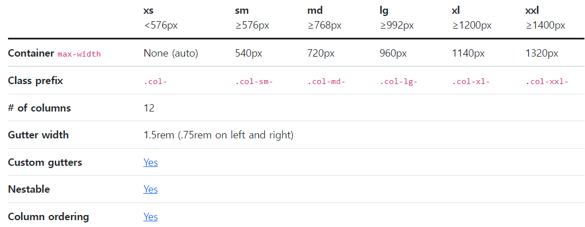
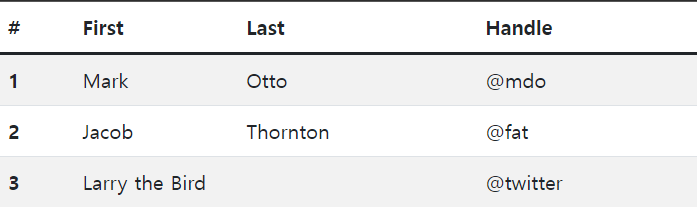
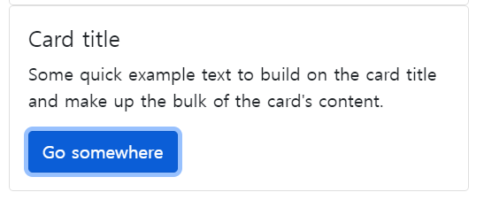
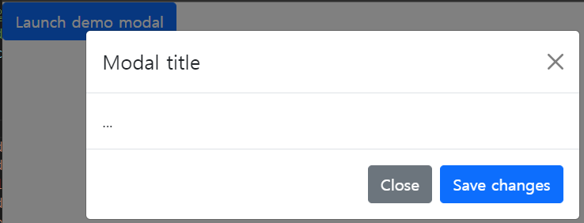
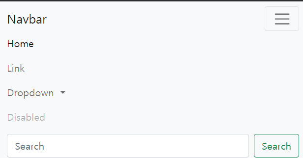

# 부트스트랩 기본 사용 방법
## CDN
 - Bootstrap 공식 홈페이지 [Bootstrap](https://getbootstrap.com/) 에서 css와 js CDN 가져오기
- - -
## Grid
```html
<div class="container-fluid">
        <div class="row">
            <div class="col-md-4 b">hello</div>
            <div class="col-md-4 b">hello</div>
            <div class="col-md-4 b">hello</div>
        </div>
        <div class="row">
            <div class="col-md-4 offset-md-4 b">hello</div>
            <div class="col-md-4 b">hello</div>
        </div>
    </div>
```

- 컨테이너 트랙의 크기를 지정해주는 속성이다.
- 부트스트랩은 전체가 12개의 컬럼으로 이루어져 있다고 생각하자
- 컨테이너로 한번 감싸고 4개씩 할당받은 것이다.
- sm, md, lg를 많이 사용한다.
- 보통 하나의 주제에 하나의 컨테이너를 넣는 것이 좋다. 만약 앞칸을 비우고 싶다면 offset-md-4 를 사용하면 4개의 블럭이 비워진다.
- container - fluid : 끝의 여백 지우기
- - -
```html
    <div class="container">
        <div class="row">
            <div class="col-md-4 b">
                
            </div>
            <div class="col-md-4 b">
                
            </div>
            <div class="col-md-4 b">
                
            </div>
        </div>
    </div>
```
- 화면 크기에 맞춰서 나열하려면 img-fluid 사용
- rounded : 모서리를 둥글게 해준다.
- rounded-circle : 사진을 원으로 나타낸다.
- - -
## table
```html
<table class="table table-striped table-hover">
        <thead>
          <tr>
            <th scope="col">#</th>
            <th scope="col">First</th>
            <th scope="col">Last</th>
            <th scope="col">Handle</th>
          </tr>
        </thead>
        <tbody>
          <tr>
            <th scope="row">1</th>
            <td>Mark</td>
            <td>Otto</td>
            <td>@mdo</td>
          </tr>
          <tr>
            <th scope="row">2</th>
            <td>Jacob</td>
            <td>Thornton</td>
            <td>@fat</td>
          </tr>
          <tr>
            <th scope="row">3</th>
            <td colspan="2">Larry the Bird</td>
            <td>@twitter</td>
          </tr>
        </tbody>
</table>
```

- table - hover : 커서가 테이블로 갔을 때 색상 변경
- table - striped : 줄무늬 색상
- - -
## color
- 부트스트랩에서 지원하는 컬러가 있으므로 사용할 것
- bootstrap 공식 홈페이지에 가면 button, 경고창 등 많이 있으니 참고하자
- - -
## card
```html
<div class="col-md-4">    <div class="card" style="width: 100%">
    <div class="card-body">
        <h5 class="card-title">Card title</h5>
        <p class="card-text">Some quick example text to build on the card title and make up the bulk of the card's content.</p>
        <a href="#" class="btn btn-primary">Go somewhere</a>
    </div>
</div></div>
```

- 굉장히 많이 사용한다. 홈페이지를 만들 때 카드들의 조각들로 많이 표현한다.
- 여러개의 사진을 돌아가면서 보고 싶다면 Carousel 를 사용하면 된다.
- - -
## Modal
```html
<!-- Button trigger modal -->
<button type="button" class="btn btn-primary" data-bs-toggle="modal" data-bs-target="#exampleModal">
    Launch demo modal
  </button>
  
  <!-- Modal -->
  <div class="modal fade" id="exampleModal" tabindex="-1" aria-labelledby="exampleModalLabel" aria-hidden="true">
    <div class="modal-dialog">
      <div class="modal-content">
        <div class="modal-header">
          <h5 class="modal-title" id="exampleModalLabel">Modal title</h5>
          <button type="button" class="btn-close" data-bs-dismiss="modal" aria-label="Close"></button>
        </div>
        <div class="modal-body">
          ...
        </div>
        <div class="modal-footer">
          <button type="button" class="btn btn-secondary" data-bs-dismiss="modal">Close</button>
          <button type="button" class="btn btn-primary">Save changes</button>
        </div>
      </div>
    </div>
  </div>
```

- 알림창으로 많이 사용한다.
- 보통 모달은 하단에 많이 모아놓는다.
- - -
## Navber

- 메뉴가 들어간다.
- - -
- Bootstrap -> example에 있는 요소들은 모두 Bootstrap으로 되어있으므로 사용할 수 있다.